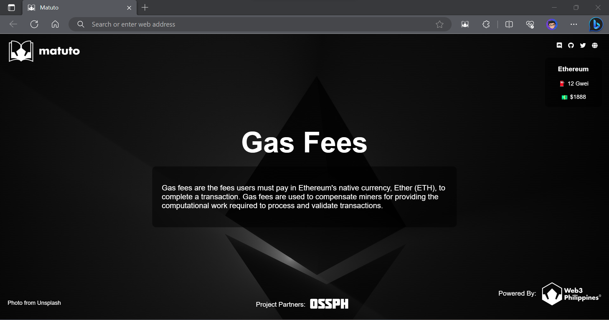
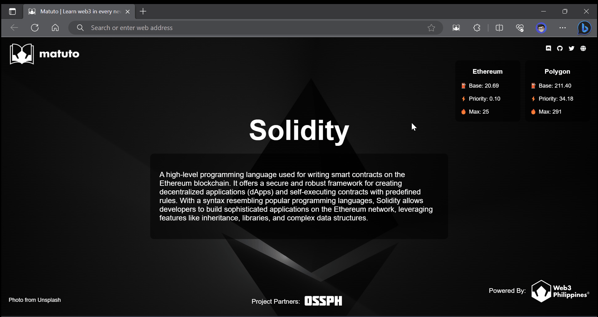

# 📖 Matuto [](https://web3philippines.org)

[](https://ossph.org) [](https://chrome.google.com/webstore/detail/matuto-learn-web3-in-ever/gbdkfpagopdnedcmmohlpmogekmfpobp) [](https://github.com/web3phl/matuto/releases) [](https://github.com/web3phl/matuto/stargazers) [](https://github.com/web3phl/matuto/blob/main/license)



Matuto is a simple chromium-based browser extension that provides a glossary of terms and definitions related to web3, blockchain and cryptocurrencies when every time you open a new tab from your browser.

It's a Filipino word which means "to learn". Which is the goal of this project, to help people learn more about web3, blockchain and cryptocurrencies. 💜💙📖

## 📦 Download

Browser | Download | Info
--- | --- | ---
**Chrome** | [Get Now](https://chrome.google.com/webstore/detail/matuto-learn-web3-in-ever/gbdkfpagopdnedcmmohlpmogekmfpobp) | For chromium-based browsers such as Brave, Opera, etc.
**Edge** | [Get Now](https://microsoftedge.microsoft.com/addons/detail/matuto/djbnlpmjbdflnjdcphaofhifcgigdbbe) | For Microsoft Edge browser.
**Firefox** | [Get Now](https://addons.mozilla.org/en-US/firefox/addon/matuto/) | For Firefox browser.

## ⚡ Demo



## 📚 Documentation

Please visit the official documentation here: [docs.web3philippines.org/matuto](https://docs.web3philippines.org/matuto)

## 💻 Development

1. Install the packages:

   ```bash
   yarn install
   ```

2. Build the extension:

   ```bash
   yarn build
   ```

3. Turn on development mode in your browser and load the extension from the `dist` directory.

> **Note**: Everytime you made changes please run `yarn rebuild` to update the extension. Go to extension management page in your browser and reload the extension.
>
> We'll think of a better way to automate this process in the future.
>
> Firefox is not yet supported, test it only on chromium based browser such as Edge or Chrome.

## 📖 Source

Right now, some of the terms and definitions are taken from [Blocknative's Glossary](https://www.blocknative.com/glossary) with modifications. We'll add more terms and definitions in the future. Please consider contributing to this project. Thanks! 🙏✨

## 🎯 Contributing

Contributions are welcome, create a pull request to this repo and we will review your code. Please consider to submit your pull request to the `dev` branch. Thank you!

Read the project's [contributing guide](./contributing.md) for more info.

## 💬 Discussions

For any questions, suggestions, ideas, or simply you want to share your experience in using this project, feel free to share and discuss it with the [community](https://github.com/web3phl/matuto/discussions)!

## 🐛 Issues

Please report any issues or bugs by [creating a new issue here](https://github.com/web3phl/matuto/issues/new/choose), also make sure you're reporting an issue that doesn't exist. Any help to improve the project would be appreciated. Thanks! 🙏✨

## 📋 Code of Conduct

Read the project's [code of conduct](./code_of_conduct.md).

## 📃 License

This project is licensed under [GNU General Public License v3](https://opensource.org/licenses/GPL-3.0).

## 📝 Author

This project is developed and maintained by [Web3 Philippines](https://web3philippines.org) and [Open Source Software Philippines](https://ossph.org) with the help of awesome [contributors](https://github.com/web3phl/matuto/graphs/contributors).

[](https://github.com/web3phl/matuto/graphs/contributors)

---

Made 💻 with 💖 by [Web3 Philippines](https://web3philippines.org) and [Open Source Software Philippines](https://ossph.org) 💜💙
